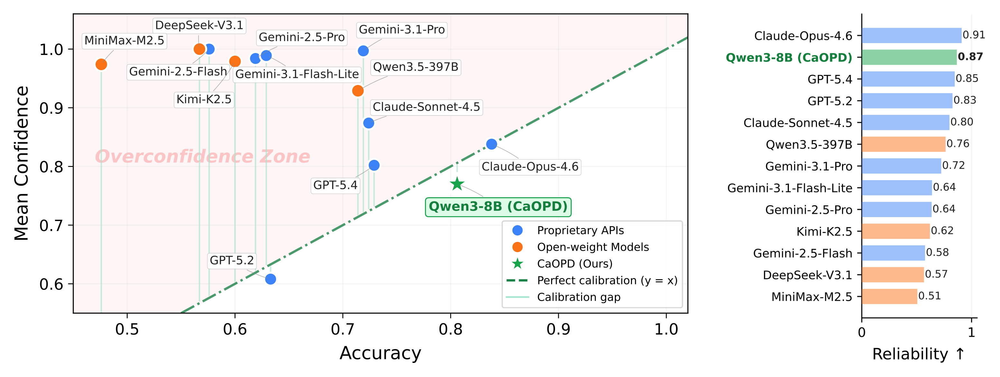
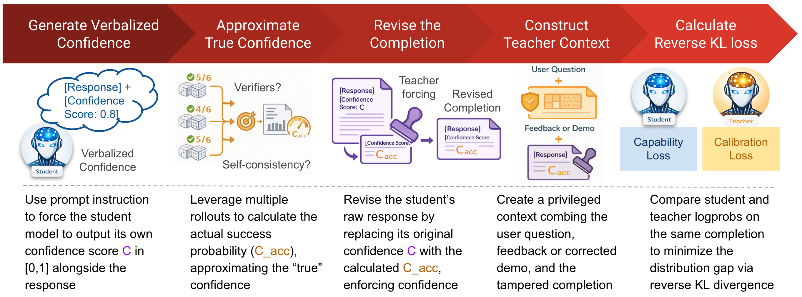

[](#python)

# CaOPD: Calibration-Aware On-Policy Distillation

> *"... AI tools do not rate their own confidence accurately. And this lowers their usefulness. We would appreciate more honest AIs."*
>
> --- Terence Tao, *The Atlantic*, "The Edge of Mathematics" (2026)

This is the official code for the paper:

### **The Illusion of Certainty: Decoupling Capability and Calibration in On-Policy Distillation**

Jiaxin Zhang, Xiangyu Peng, Qinglin Chen, Qinyuan Ye, Caiming Xiong, Chien-Sheng Wu

**Salesforce AI Research**

[[Paper]](https://arxiv.org/abs/XXXX.XXXXX)

On-policy distillation (OPD) is an increasingly important paradigm for post-training language models. However, we identify a pervasive **Scaling Law of Miscalibration**: while OPD effectively improves task accuracy, it systematically traps models in severe overconfidence. We trace this failure to an information mismatch — teacher supervision is formed under privileged context available during training, whereas the deployed model must report confidence using only deployment-time information. We propose **CaOPD** (Calibration-Aware On-Policy Distillation), a framework that estimates empirical confidence from model rollouts, replaces self-reported confidence with this student-grounded target, and distills the revised response through the standard self-distillation loss. Experiments across Science Q&A and Tool Use domains show that CaOPD **preserves or improves task accuracy** while **drastically improving calibration**, achieving near-zero overconfidence gaps and strong confidence discrimination.

<p align="center">
  
</p>

**Figure 1: The Scaling Law of Miscalibration.** (Left) Mean Confidence vs. Accuracy on Science Q&A. Almost all modern LLMs are trapped in the red *Overconfidence Zone*, exhibiting massive calibration gaps. Scaling up capability does not resolve this blind optimism. (Right) **CaOPD** structurally eliminates this bias by decoupling capability from calibration. It pulls the model back to the ideal calibration line, enabling a compact 8B model to achieve top-tier reliability (1-Brier Score) that rivals frontier LLMs (APIs & Open-weight Models).

---

## :fire: News & Updates

- **[2026.04]** CaOPD code and datasets are released.
- **[2026.04]** CaOPD paper is submitted to [COLM 2026](https://colmweb.org/). ArXiv link coming soon.

---

## :thinking: What is CaOPD and How Does It Work?

**The Problem**: On-Policy Distillation methods (SDFT, SDPO) train a student model using a teacher with privileged context (ground-truth demos, correct solutions). The student learns the teacher's *confident tone* but lacks the teacher's *evidence*. Result: the student blindly reports near-maximum confidence even when it is wrong.

**The Solution**: CaOPD adds a single, clean modification to any OPD loop — **target replacement** with the student's empirical success rate.

<p align="center">
  
</p>

### The CaOPD Algorithm (4 Steps)

**Step 1 — On-Policy Rollouts**: For each prompt, generate K rollouts from the student model (e.g., K=8). Verify each against ground truth using a task-specific verifier.

**Step 2 — Compute Empirical Success Rate**:
```
P_acc = (number of correct rollouts) / K
```

**Step 3 — Target Replacement** (3 locations):
| Location | What changes |
|----------|-------------|
| Student completion | Strip existing `Confidence: X.XX`, append `Confidence: {P_acc}` |
| Teacher demo confidence | Replace `Confidence: 1.00` → `Confidence: {P_acc}` |
| Teacher Note injection | Insert *"The empirical confidence for this question is {P_acc}. Output this exact value."* |

**Step 4 — Self-Distillation**: Train with standard KL divergence loss between student (modified completion) and teacher (modified context). No special loss weighting needed.

### Two Teacher Context Templates

CaOPD supports two teacher context modes, following the SDFT and SDPO paradigms:

**Demo mode** (`--teacher_context_mode demo`, [Paper Appendix C.3.1]):
```
{original_question}

This is an example for a response to the question:
{ground_truth_demonstration}
Confidence: {P_acc}

Now answer with a response of your own, including the thinking process.
```

**Correct solution mode** (`--teacher_context_mode correct_solution`, [Paper Appendix C.3.2]):
```
{original_question}

Correct solution:
{verified_correct_rollout}
Confidence: {P_acc}

Correctly solve the original question.
```

---

## :robot: Installation

```bash
git clone https://github.com/SalesforceAIResearch/CaOPD.git
cd CaOPD
pip install -r requirements.txt
```

**Hardware**: Tested on NVIDIA H200 GPUs. A single node (8xH200 GPUs) is sufficient for 7B-8B models with default settings.

**Note**: For running CaOPD on the SDPO backbone, please refer to the [SDPO repository](https://github.com/lasgroup/SDPO) for additional installation requirements.

---

## :rocket: Quick Start

### Training CaOPD (Tool Use)

```bash
accelerate launch --num_processes 1 main.py \
    --model_name Qwen/Qwen3-8B \
    --dataset_name tooluse \
    --output_dir outputs/caopd_tooluse \
    --num_generations 8 \
    --teacher_context_mode demo
```

### Training CaOPD (Science / Chemistry)

```bash
accelerate launch --num_processes 1 main.py \
    --model_name Qwen/Qwen3-8B \
    --dataset_name science \
    --output_dir outputs/caopd_science \
    --num_generations 8 \
    --teacher_context_mode demo
```

See `scripts/` for complete example shell scripts.

### Key Arguments

| Argument | Default | Description |
|----------|---------|-------------|
| `--dataset_name` | `tooluse` | Dataset: `tooluse` or `science` |
| `--num_generations` | `8/16` | Rollouts per prompt (K). More = finer P_acc |
| `--teacher_context_mode` | `demo` | `demo` or `correct_solution` |
| `--no_empirical_calibration` | `False` | Disable CaOPD; run plain SDFT |
| `--model_name` | `Qwen/Qwen3-8B` | HuggingFace model name or path |
| `--learning_rate` | `{1e-5, 2e-5}` | Learning rate |
| `--num_prompts_per_batch` | `32` | Gradient accumulation steps |

**Tested Models**: We have tested CaOPD with `Qwen/Qwen3-8B`, `allenai/OLMo-3-7B-Instruct`, and `Qwen/Qwen2.5-7B-Instruct`, as well as the broader Qwen3 family from 0.6B to 32B for scaling analysis.

---

## :bar_chart: Evaluation

### Accuracy Evaluation (from SDFT)

```bash
# Tool Use
python eval_tooluse.py --model_path outputs/caopd_tooluse/checkpoint-XXX

# Science (Chemistry)
python eval_science.py --model_path outputs/caopd_science/checkpoint-XXX
```

### Calibration Evaluation

After running inference and saving results as JSON:

```bash
# Tool Use calibration metrics
python eval/run_eval_tooluse.py \
    --input outputs/tooluse_inference.json \
    --output outputs/tooluse_metrics.json

# Chemistry calibration metrics
python eval/run_eval_chemistry.py \
    --input outputs/chemistry_inference.json \
    --output outputs/chemistry_metrics.json
```

### Calibration Metrics

| Metric | Description |
|--------|-------------|
| **ECE** | Expected Calibration Error — alignment between confidence and accuracy |
| **Brier Score** | Mean squared error between confidence and binary correctness |
| **SPR** | Strict Pairwise Ranking: P(c+ > c-). Ties get zero credit, exposing confidence saturation |
| **OCG** | Overconfidence Gap: mean confidence − accuracy. Positive = overconfident |

---

## :bulb: Adapting CaOPD to Other OPD Methods

CaOPD is designed to be a simple, modular add-on to any OPD method. The core changes are:

1. **Add confidence to the prompt** — Insert a confidence instruction in the student prompt (see `_inject_inline_confidence` in `main.py`).
2. **Compute P_acc from rollouts** — After generating K rollouts per prompt, verify each and compute `P_acc = correct_count / K`.
3. **Replace confidence in 3 places** — Student completion, teacher demo, and teacher note (see `distil_trainer.py`, search for "CaOPD").
4. **Disable importance sampling** — The modified trajectory invalidates vLLM sampling logprobs.
5. **Use the standard KL loss** — No special loss weighting needed.

---

## :file_folder: Repository Structure

```
CaOPD/
├── main.py                  # Entry point: args, dataset loading, confidence injection
├── distil_trainer.py        # Training loop with CaOPD modification
├── distil_config.py         # Configuration
├── eval_tooluse.py          # Accuracy evaluation for tool use
├── eval_science.py          # Accuracy evaluation for science
├── eval/                    # Calibration evaluation
│   ├── calibration_metrics.py   # ECE, Brier, SPR, Overconfidence Gap
│   ├── parse_confidence.py      # Extract confidence from model outputs
│   ├── tooluse_correctness.py   # Tool-use answer verification
│   ├── chemistry_correctness.py # Chemistry MCQ answer verification
│   ├── run_eval_tooluse.py      # Tool-use calibration eval script
│   └── run_eval_chemistry.py    # Chemistry calibration eval script
├── scripts/                 # Example training shell scripts
├── data/                    # Datasets (tool use + science)
├── figures/                 # Paper figures
├── requirements.txt
└── LICENSE                  
```

---

## :pencil: Citation

If you find this work useful, please cite our paper:

```bibtex
@inproceedings{zhang2026illusion,
  title={The Illusion of Certainty: How On-Policy Distillation Creates Overconfident Language Models},
  author={Zhang, Jiaxin and Peng, Xiangyu and Chen, Qinglin and Ye, Qinyuan and Xiong, Caiming and Wu, Chien-Sheng},
  year={2026}
}
```

---

## :pray: Acknowledgements

This codebase is built upon the following excellent open-source projects:

- **[SDFT (Self-Distillation Fine-Tuning)](https://github.com/shenfeld/self-distillation)** by Shenfeld et al. — Our training infrastructure and base codebase.
- **[SDPO (Self-Distilled Policy Optimization)](https://github.com/lasgroup/SDPO)** by Hubotter et al. — Reference for the "correct solution" teacher context template.


